# 32B 强化学习训练链路 · 逐段讲解

---

## 本节速览

**本节主要做的事**：把这条 32B 强化学习链路**从数据一路讲到参数更新**，每一步说清它拿到什么、
交出什么、以及不这么做会怎么崩。

**主要思路**

1. 先说清任务：要改的是推理过程的**写法**，不是答案。答案一个字不许动。
2. 先量尺子再优化：唯一靠大模型判的那件事，先测出它的噪声有多大，再决定判据。
3. 三件套评测，一个工具只判一件事，单独刷高任何一个都没用。
4. 四个阶段递进：冷启动教写法 → 拒绝采样自采自训 → 偏好对 → 在线强化。
5. 在线奖励是**词典序硬门**，不是加权和。答案漂了，推理写得再好也补不回来。

**本节要读的文件**

| 文件 | 干什么 | 讲在本节 |
| --- | --- | --- |
| `src/data/schema.py` | 三种训练样本的拼装，answer-lock 就在这 | 第 4 章 |
| `src/rewards/rules.py` | 确定性规则层：检索腔标记 + 答案漂移 | 第 7 章 |
| `src/rewards/calibration.py` | 裁判标定表、σ-可分判据、真涨门 | 第 11 章 |
| `src/rewards/grpo_reward.py` | 在线奖励函数，词典序硬门 | 第 7 章 |
| `src/training/pipeline.py` | 主线编排：四阶段、断点续跑、阶段门 | 第 5 章 |
| `src/evaluation/metrics.py` | 三件套判分与报告 | 第 11 章 |
| `configs/train.yaml` | 全流程唯一配置 | 贯穿全篇 |

**前置术语**：think / answer · 检索腔 · answer-lock · 认可答案池 · 三件套 · 真涨门 · rollout ·
优势 · 参考模型 · LoRA · ZeRO。第一次出现的地方都有一句大白话解释，不用提前查。

> 全篇最值得看的是 **7.2**（为什么奖励必须是硬门不是加权和）和 **8.4**（一个序列级的分数，
> 怎么落到 think 段每一个 token 上）。这两处是这条链路和"调框架命令"的分界线。

---

## 第1章 任务目标

到目前为止，我们手上有这些东西：

- 一个 32B 规模的领域模型。它能答对题，格式也对，`<think>` 和 `<answer>` 两段齐全。
- 一批领域语料。每条是一道题，题面里带着几段参考问答对。
- 一台多卡机器，和一个可以调的外部大模型当裁判。

但还差最关键的一步：**这个模型的推理过程读起来不像在推理，像在念检索到的材料，怎么把它改过来，
同时保证答案一个字不变？**

如果没有这一层会怎么样？模型的 `<think>` 里一直是"根据参考问答对1"、"资料显示"、"检索结果表明"。
对外宣称的是端到端推理，用户看到的是一个在读检索结果的东西。而如果为了改这个去做常规微调，
最容易发生的事是：推理段确实洗干净了，答案也跟着变了——推理好看了，产品坏了。

这一节的主角，就是这条四阶段强化学习链路——入口在 **`scripts/train.sh`**，主线编排在
**`src/training/pipeline.py`**。

### 1.1 这条链路在什么位置

它坐在"一个已经能用的领域模型"和"一个推理过程读起来像人的领域模型"之间。它不负责让模型更准，
也不负责教它新知识。它只做一件事：**改推理过程的写法，锁死答案**。

上游是领域模型的常规微调，那一步的产出就是这里的基座。下游是部署。这条链路夹在中间，
输入一个模型，输出一个模型。

### 1.2 一句话理解

> **让模型自己采样、用一把量过噪声的尺子筛出更干净的推理、再拿这些样本训自己；
> 全程把答案段锁死，让梯度只能压在推理段上。**

这句话拆成四段，正好对应后面四章：「自己采样」是第 6 章 rollout；「量过噪声的尺子」是第 11 章
标定和真涨门；「筛出更干净的推理」是第 7 章奖励和门控；「把答案段锁死」是第 4 章 answer-lock。

定位和直觉都有了，下面先把范围划清楚。

### 1.3 本节范围（重要）

| 内容 | 本节 | 备注 |
| --- | --- | --- |
| 数据怎么造、四种格式长什么样 | ✅ | 第 4 章 |
| 四个阶段各训什么、怎么串起来 | ✅ | 第 5 章 |
| rollout / 奖励 / 优势 / 损失 / 参数更新 | ✅ | 第 6~9 章 |
| 显存和分布式 | ✅ | 第 10 章 |
| 三件套评测与统计判据 | ✅ | 第 11 章 |
| 具体的实验结果数字 | ⛔ | 本仓库是可读实现，不含实验数据；评测方法在第 11 章，跑出来的数字在你自己的 `output/eval/` 下 |
| PPO 的 critic / GAE | ⚠️ | 只在第 13 章作为对照提一句。这条链路用的是 GRPO，没有 critic |
| 基座本身怎么微调出来的 | ⛔ | 上游的事，不在这条链路里 |

也就是说：**这份文档讲清楚这条链路的每一个齿轮怎么咬合，不讲它跑出来多少分。**

范围划完了，下面先给四个可以直接说出口的版本。

---

## 第2章 四个口述版本

面试问项目，问法只有四种粒度：一句话、半分钟、两分钟、五分钟。四个版本必须互相自洽，
细的那个只是把粗的那个展开，不能出现新的说法。

### 2.1 一句话

> 在一个 32B 领域模型上做四阶段强化学习（冷启动 SFT → 拒绝采样 → DPO → 在线 GRPO），
> 把它的推理过程从检索腔改造成自然推导，同时用硬门锁死答案不漂移；
> 产出是一条从数据构建到离线评测的完整可复跑训练链路。

### 2.2 三十秒版本

> 这个项目要解决的是：一个 32B 领域模型对外说自己做端到端推理，但它的 think 段全是
> "根据参考资料"、"检索结果表明"这种检索腔。约束是不能蒸馏——这个领域没有更强的老师模型，
> 所以只能让它自己采样、自己筛、再训自己。
>
> 我负责的是整条链路：数据构建、四个阶段的训练编排、奖励函数、评测口径。
> 具体是冷启动 SFT 教写法，拒绝采样把 grounding 拉回来，DPO 做偏好学习，最后在线 GRPO。
> 全程有一条铁律叫 answer-lock：训练样本的答案段永远拼基座原版，只有 think 不同，
> 梯度就只能压在推理段上。
>
> 做完这个项目，我对整条 RL 训练链路每一环在做什么、为什么这么设计，都能讲到代码级。

### 2.3 两分钟版本

按数据 → 模型 → rollout → 奖励 → 优势 → 损失 → 更新 → 评测 的顺序讲。

**数据。** 先让基座对全部题目重跑一遍，拿到两样东西：它的答案，当金标准；它的原推理，
当后面要改造的对象和对照。然后切出一个固定条数的冻结验收集，全程不参与任何训练和选样。
再让基座对每题贪心一次加采样八次，把这些答案存成一个"认可池"——后面判"答案漂没漂"就拿它当靶子。

**模型。** 32B 全参训不动，四个阶段全走 LoRA，只训注意力和 MLP 的七个投影矩阵。
每个阶段结束把 LoRA 合并回基座，产出一个全量模型，下一阶段在它上面再训一个新的 LoRA。
参考模型不用额外加载——把新 LoRA 关掉，剩下的就正好是冻结的起点模型。

**Rollout。** 强化学习没有标准答案，只有一个打分函数。要知道模型现在写得怎么样，
只能让它自己先写一批出来。所以每一步都比监督微调多一轮完整生成。温度必须高于 0，
否则采出来的 K 条几乎一模一样，组内没有差异，"哪条更好"这个信号就不存在。

**奖励。** 是一个词典序硬门，不是加权和：格式失败 < 答案漂出池 < 规则查出检索腔 < 规则也过了。
越靠前越不可补偿。只有前三道门全过的候选才会去调裁判模型，裁判分只用来在这批"都合格"的候选之间排序。

**优势。** GRPO 没有 critic。一个 prompt 采 K 条，这 K 条的奖励减去组内均值再除以组内标准差，
就是每条的优势。谁比这一组的平均水平好，谁的概率被推高。

**损失。** 优势是序列级的一个标量，但它会乘到这条序列**每一个 token** 的对数概率上。
再加一项 KL，把策略拉住不要离参考模型太远。

**更新。** 梯度累计若干步凑够有效批量，再 optimizer.step()，清梯度。

**评测。** 三件套：裁判打的干净分、规则算的检索腔通过率、规则算的答案在池率。
干净分有噪声，两阶段差值要过三倍标准误才算真涨。

### 2.4 五分钟版本

五分钟版本 = 两分钟版本 + 每一步"上一步的输出怎么变成下一步的输入" + 每一步"不这么做会怎么崩"。

**第一步交出的是"金标准答案 + 待改造的推理"。** 为什么要重产而不是直接用语料里的答案？
因为这条链路保证的是"答案不漂离**这个基座**"。拿别处的答案当锚，模型只要和基座本来的行为
不一致就被判漂，那测的是基座和别人的差异，不是训练带来的变化。

**第二步交出的是"一个永远不许碰的验收集"。** 它必须在任何训练动作之前切出来，而且是固定条数
不是固定比例——语料条数会因为上游丢弃空答案而波动，按比例切会让验收集每次差几条，
两次评测就不能直接比了。

**第三步交出的是"答案漂移的判定靶子"。** 更省事的做法是拿贪心那一条当唯一正确答案。
那条路会把基座自己的正常波动也算成漂：同一道题它这次说"免征增值税"、下次说"可以免税"，
意思一样措辞不同。采多条取范围，判的才是"漂没漂出基座愿意给的答案集合"。

**第四步（冷启动）交出的是"模型第一次见到的自然推理长什么样"。** 这一步不能省。
直接上强化学习，采出来的 K 条全是检索腔，组内没有好样本可选，优势估计全是噪声，学不动。

**第五步（拒绝采样）交出的是"模型自己写出来的、经过筛选的推理"。** 冷启动学的是裁判模型的稿子，
写法和模型自己的分布有距离；而且冷启动只管写法，不管 grounding——模型可能学会了不说
"参考问答对"，同时也不再老实扣着资料推了。这一步的答案硬门把 grounding 拉回来。

**第六步（偏好对）交出的是"什么更好"这个信号。** 前面两步都是"照着这个写"，这一步第一次
告诉模型"这个比那个好"。rejected 直接用基座原推理，零成本，而且和 chosen 天然分得开。

**第七步（在线 GRPO）交出的是"每一步都用当前策略重新采样"这件事。** 前面所有阶段的训练数据
都是事先固定的，模型学到的上限被数据钉死。在线阶段每一步都重新采、重新打分，
模型能往它当前写得出来的最好方向再走一点。

**最后是评测。** 三件套必须一起看。只看干净分，模型可以写一段和参考毫无关系的空话；
只看规则通过率，不说那几个词就满分；只看在池率，原地不动就是满分。三个都要涨，只有一条路：
真把推理写好。

口述版本齐了，下面把整条链路画出来。

---

## 第3章 项目整体架构

这张图要说明的是：从原始语料到最终模型，一共要过哪些格子，以及哪几格是共享上游、
哪几格是每个阶段各跑一遍。

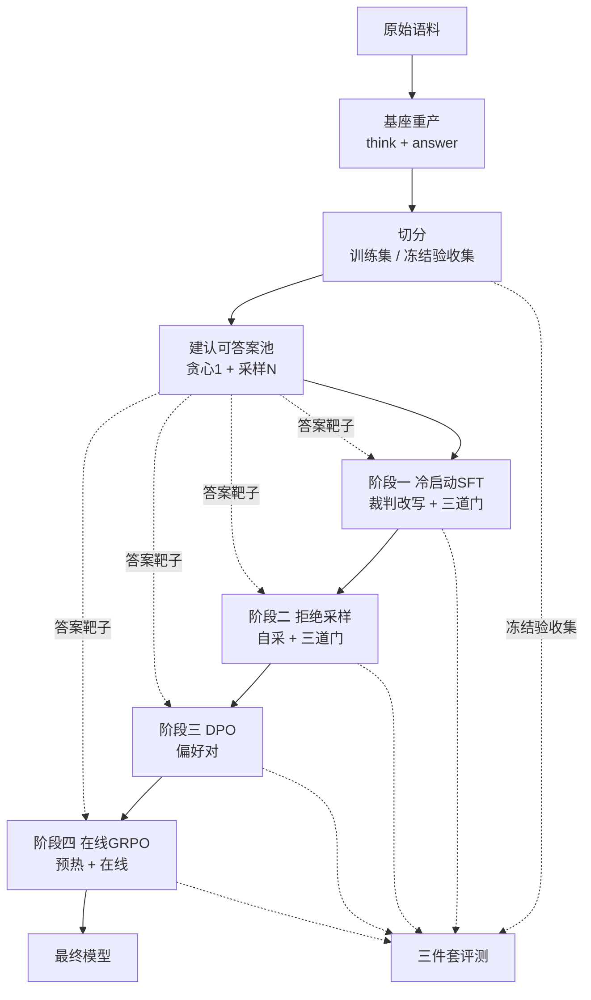

*图1：上游三步只跑一次，四个阶段各自建数据、各自训、各自评*

从图里该看出三件事：

1. **认可答案池是全链路共享的一根轴** ——四个阶段的答案硬门、以及评测的在池率，
   用的是同一个池子、同一套抽取口径。口径分家，训练信号和成绩单就会对不上。
2. **冻结验收集从切分那一刻起就断线了** ——它只连到评测，不连任何训练或选样步骤。
   这条线画错一次，后面所有数字都白算。
3. **四个阶段是串行的，每一格的输入是上一格的输出** ——不是四个并列的方案，
   是一条递进的线。前一步不做，后一步没法做。

下面把每个格子展开。

---

## 第4章 数据：从一条题面到四种训练格式

### 4.1 原始样本长什么样

输入语料每行两个字段：

```json
{"query": "小规模纳税人本月销售额9万元，需要缴纳增值税吗？",
 "user_prompt": "【参考问答对】\n问：小规模纳税人月销售额未超过10万元是否免征增值税？\n答：自2023年1月1日起，增值税小规模纳税人月销售额未超过10万元的，免征增值税。\n\n【问题】\n小规模纳税人本月销售额9万元，需要缴纳增值税吗？"}
```

`user_prompt` 是喂给模型的完整题面。两个标记很要紧：`【参考问答对】` 和 `【问题】`。
参考资料段就是从这两个标记之间切出来的（`src/data/parsing.py` 的 `extract_references`）。

**为什么不能把整个题面喂给裁判。** 裁判要判的是"这段推理是不是在复述参考资料"。
把整个题面给它，题面尾部还带着问题本身，裁判会把"复述题干"也算成照抄，判分就歪了。

### 4.2 模型输出长什么样

```text
<think>
先看这个月卖了多少——9万；小规模这档免税线是10万，9万还在线里没踩上，那这部分增值税就免了。
</think>

<answer>
不需要。本月销售额9万元，未超过10万元的免税标准，免征增值税。
</answer>
```

基座是**自己吐标签**的，不靠模板注入。这一点决定了两件事：训练目标里必须带上开头那个
`<think>`（少了它，学出来的模型不吐开标签，下游所有解析全部失效）；解析函数要对
"自己吐"和"模板注入"两种都能解。

### 4.3 两个解析函数，为什么必须分开

这是一个很容易被合并掉、合并了会静默出错的地方。

| 函数 | 用在哪 | 遇到"生成到最大长度、卡在 think 里断了"怎么办 |
| --- | --- | --- |
| `parse_think_answer` | 数据构建 | 找不到 `</think>`，把整段当 answer 返回 |
| `parse_think_answer_diagnostic` | 评测、在线奖励 | 保留那段残缺推理，answer 明确置空，标格式失败 |

一个更省事的做法是全链路只留容错版。那样评测时会发生这件事：一条彻底没写完的输出，
残缺推理里恰好没有检索腔词，于是规则通过；整段被当成 answer，于是答案在池。
**一个格式全崩的模型，成绩单上反而好看。**

所以评测侧一律走诊断版，并且额外记一个"格式完整率"单独披露。

### 4.4 数据清洗：丢什么、按什么去重

切分这一步只做三件事，每件都有理由：

| 做什么 | 为什么 |
| --- | --- |
| 丢掉没有参考资料或没有答案的行 | 没有参考就没有"是否复述参考"这个判断对象；没有答案就没有 answer-lock 的锚 |
| 按 `sha1(query)[:12]` 去重 | 链路中途会洗牌、早停，行号根本对不上，只能用内容哈希当主键 |
| 固定条数切验收集，固定种子 | 按比例切会让验收集每次跑差几条，两次评测就不能直接比 |

### 4.5 answer-lock：整条链路的核心不变量

这张图要说明的是：一对偏好数据里，两边到底哪一段相同、哪一段不同，以及为什么这个安排让梯度
只能作用在推理段上。

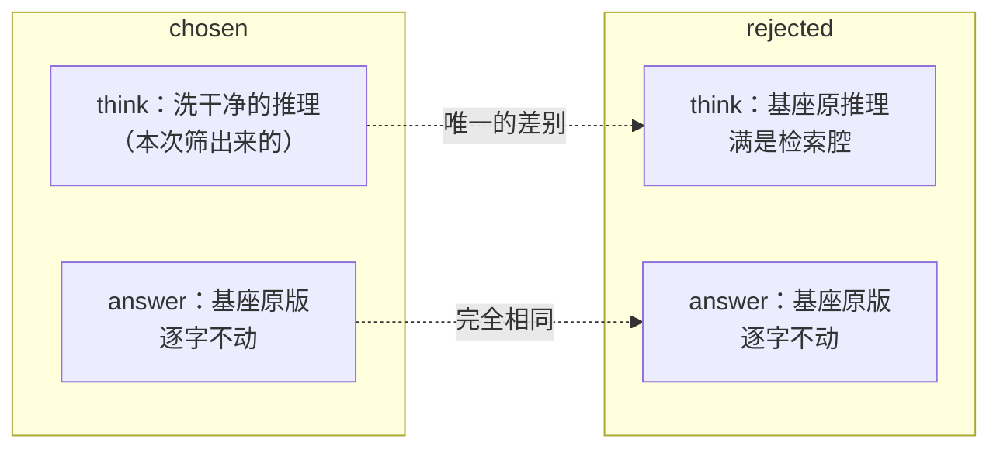

*图2：一对偏好数据里，answer 段逐字相同，差别全在 think 段*

从图里该看出两件事：

1. **对比维度只剩一个** ——两边 answer 段完全一样，模型没有别的维度可以走捷径。
   它想让 chosen 的概率高过 rejected，只能靠把 think 写得更像 chosen 那样。
2. **梯度在 answer 段天然抵消** ——DPO 的损失算的是 chosen 和 rejected 的对数概率之差。
   同一段 answer 在两边贡献同样的对数概率，做差之后这一段的贡献互相抵消。

一个更省事的做法是让裁判模型把 think 和 answer 一起重写，反正它写得更漂亮。
那条路会这样崩：梯度不认识"我只想改 think"这件事。answer 段一旦跟着变，模型学到的就是
"整段输出都可以改"。几百步之后 answer 开始漂，而 think 干净分还在涨——**指标全绿，产品坏掉。**

副作用是偏好对的构造变得零成本：rejected 直接用基座原推理配同一段原答案，不用额外生成、
额外打分，而且这一对天然分得开。

### 4.6 三种训练格式

代码在 `src/data/schema.py`，样例在 `examples/sample_train_rows.jsonl`（由代码直接生成，
和实现永远一致）。

| 格式 | 用在哪 | 结构 | 有没有 assistant 段 |
| --- | --- | --- | --- |
| `sft_row` | 冷启动、拒绝采样 | system / user / assistant 三段 | 有，是训练目标 |
| `dpo_row` | 偏好对 | chosen 在 messages 末尾，rejected 在顶层 `rejected_response` | 有 |
| `grpo_row` | 在线强化 | 只有 system / user，外加 `v1_answers_json` | **没有** |

第三种没有 assistant 段，因为在线阶段的答案是训练时现场采出来的。行里带的是采完之后
算奖励要用的料——尤其是那个答案池。

**为什么答案池要随行带，而不是让奖励函数去读一个共享文件。** 奖励函数跑在多个分布式 worker 里。
让每个 worker 各自去读一个外部路径，等于给"某个 worker 读到的是旧文件"留了口子。
这种错完全不报错，只是奖励算歪。

### 4.7 冷启动数据：三道门，从便宜到贵

这张图要说明的是：一条改写稿要过三道门才进训练集，以及为什么门的顺序是这样排的。

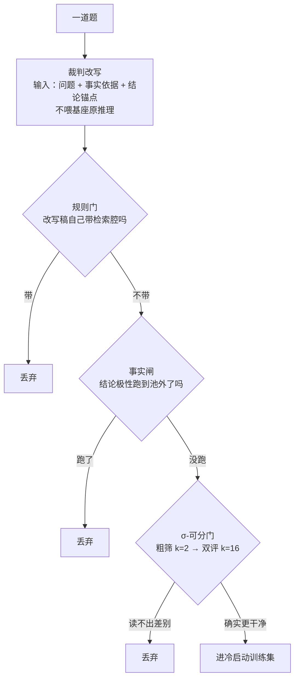

*图3：三道门按"每道门要花多少钱"从便宜到贵排列*

从图里该看出三件事：

1. **前两道门是确定性的，零成本** ——它们必须排在最贵的那道门前面，把注定过不了的样本先筛掉。
   顺序反了，钱会花在一批马上要被丢掉的样本上。
2. **改写不喂基座原推理** ——只给问题、事实依据、结论锚点。这一条是关键，见下面 4.8。
3. **σ 门自己也分两级** ——先打两遍粗筛，均值都没比对照高就直接弃；过了才各打十六遍去确认。

### 4.8 为什么改写时不喂原推理

一个更省事的做法是：把基座原来那段 think 喂给裁判模型，让它"改写得自然一点"。

那样写出来的东西会死死锚在原文措辞上——能换的只有词，句子骨架还是原来那副。
而判分口径恰恰只数"有几句是把参考换个说法重讲一遍"。于是改出来的稿子分数上不去，
整条冷启动数据的质量被这个天花板压死，而且**压得很隐蔽**：每一条稿子读起来都比原文自然，
只是分数就是上不去。

所以这里不喂原推理，只给问题、事实依据、和一个结论锚点，让裁判从问题出发自己推。
没有原文可锚，也就没有可复述的句子。

**结论锚点也是结构化的，不是一段答案原文。** 给原文，改写模型就有东西可以复述；
给"结论方向=免征、可用数字=10万/9万"这种字段，它没有句子可抄，只能自己组织语言。
这一步同时让改写结果天然落在评测那道"答案在池"门的靶子上——因为锚点就是从池子里抽出来的。

### 4.9 事实闸为什么只拦极性，不拦数字

一个更严的做法是：改写稿里出现的任何数字，只要不是从池子里逐字抄来的，就判臆造。

这条路会系统性误杀最像人的那一批样本。"9万还差1万到10万这条线"里的"1万"是算出来的，
池子里没有——但它恰恰是"代入数字一步步推"的证据。把这类样本全杀掉，剩下的就只有干巴巴罗列的。

所以数字的合法算术派生放过，只拦"推向池子里没有的结论极性"，也就是推出了相反或更宽更严的结论。
最终答案由 answer-lock 保着，结论数字由锚点锁在输入里，think 只需要不和池子矛盾。

**这一闸挡不住什么**：算错的数字。"9万差1万到10万"和"9万差2万到10万"，闸门都放过。
这条链路不管答案对错，只管别推出相反结论。

数据讲完了，下面看模型这一侧怎么加载、四个阶段各训什么。

---

## 第5章 模型加载与训练结构

### 5.1 32B 怎么训得动

全参微调一个 32B 模型，光优化器状态就要几百 G 显存。这条链路四个阶段全走 **LoRA**——
在原权重旁边挂一对低秩矩阵，训练只更新这对小矩阵，原权重冻结。

配置在 `configs/train.yaml` 的 `train` 段：秩 16、缩放系数 32、dropout 0.05，
挂在 `q_proj k_proj v_proj o_proj gate_proj up_proj down_proj` 七个投影矩阵上。

| 概念 | 一句话 |
| --- | --- |
| **LoRA** | 冻结原权重 W，另训两个小矩阵 A、B，前向时算 `Wx + BAx`。可训练参数量掉到千分之几 |
| **秩 r** | A、B 的中间维度。越大表达力越强、越贵。16 是一个常见的起点 |
| **缩放系数 α** | LoRA 那一支的输出乘 `α/r`。这里 α=32、r=16，即放大 2 倍 |

这条链路**没有用 QLoRA**（把基座量化到 4bit 再挂 LoRA）。因为有多卡可用，
ZeRO-3 分片已经装得下，量化带来的精度损失不值得。

### 5.2 四个阶段怎么串

这张图要说明的是：每个阶段的起点是什么、参考模型从哪来、以及为什么每个阶段结束都要合并一次。

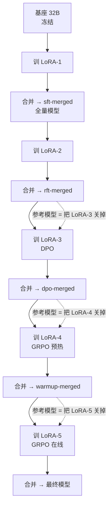

*图4：每阶段"全量基座 + 新建 LoRA"，参考模型就是把新 LoRA 关掉*

从图里该看出三件事：

1. **参考模型不需要额外加载一份权重** ——起点是全量模型，训的是一个全新的 LoRA。
   把这个 LoRA 关掉，剩下的正好就是冻结的起点模型。显存省下一整份，而且不存在
   "参考模型到底包不包含上一个 adapter"这种要读框架源码才能确定的含糊。
2. **每阶段结束必须合并** ——不合并的话，下一阶段的基座上还挂着旧 adapter，
   上面那条"关掉新 LoRA 即得参考"就不成立了。
3. **代价是磁盘** ——五个全量模型，每个都是一份完整基座大小。下一阶段只依赖上一阶段，
   跑到后面可以把更早的删掉。

### 5.3 有没有 critic、有没有 reward model

都没有。这一点在面试里经常被追问，答案要干脆。

| 组件 | 这条链路里有没有 | 说明 |
| --- | --- | --- |
| **actor（策略模型）** | 有 | 就是当前在训的那个 LoRA + 全量基座 |
| **critic（价值模型）** | **没有** | GRPO 用组内相对好坏代替价值函数，这正是它比 PPO 省的地方 |
| **reward model（打分模型）** | **没有** | 奖励是规则 + 外部裁判 API 算出来的，不是训出来的一个模型 |
| **reference model（参考模型）** | 有 | 起点全量模型（把新 LoRA 关掉），用来算 KL |

奖励为什么不训一个 reward model：训 RM 需要大量人工标注的偏好数据，而这条链路的判据里
有两条本来就是确定性规则（检索腔标记、答案漂移），剩下那一条（换词复述）交给外部大模型判。
既省了标注，也省了"RM 自己也会被 hack"这一层问题。

### 5.4 训练和推理分别由谁扛

| 环节 | 谁做的 | 在哪 |
| --- | --- | --- |
| 监督微调 / 偏好优化 / 在线强化 | **ms-swift** | `scripts/swift/{sft,dpo,grpo}.sh` |
| 参数分片、优化器状态切分 | **DeepSpeed ZeRO-3** | 训练脚本的 `--deepspeed zero3` |
| 低秩适配 | **PEFT**（由 ms-swift 调用） | `--train_type lora` |
| 数据构建 / 评测的推理 | **vLLM，独立 HTTP 服务** | `scripts/serve_vllm.sh` |
| 在线 GRPO 的采样 | **vLLM，colocate 模式住在训练进程内** | `--vllm_mode colocate` |
| LoRA 合并 | **ms-swift export，CPU 上做** | `scripts/merge_lora.sh` |

**为什么离线采样走 HTTP 服务而不是在进程里加载权重。** 加载一次 32B 要几分钟、占几十 G。
数据构建要对上千道题各生成若干条，每个步骤脚本自己加载一遍的话，光加载时间就超过生成时间。
serve 成常驻服务，加载只付一次，而且 vLLM 的连续批处理能把并发请求合并成大 batch。

**代价是 GPU 互斥。** 推理服务占着卡的时候训练起不来。所以编排器在每次训练前必须显式停服务，
而且是按**进程组**停——张量并行会拉起一堆 worker 子进程，只 kill 主进程的话 worker 还占着显存。

### 5.5 多卡怎么组织

训练侧：`CUDA_VISIBLE_DEVICES` 指定卡号，卡数即 `NPROC_PER_NODE`，DeepSpeed ZeRO-3 做分片。

推理侧（离线服务）：卡数即张量并行度，一个模型横着切到几张卡上。

在线 GRPO（colocate）：训练器和推理引擎住在同一批卡上，推理侧的张量并行度对齐训练进程数——
两套并行切分不一致会打架。

模型这一侧讲完了，下面进强化学习的第一环：rollout。

---

## 第6章 Rollout：强化学习为什么非采样不可

### 6.1 一句话说清 rollout

监督微调的训练数据是现成的：一条输入配一条标准答案，算交叉熵就完了。

强化学习没有标准答案，**只有一个"这条输出好不好"的打分函数**。要知道模型现在写得怎么样、
哪条写法更好，只能让它自己先写出来，再拿去打分。这个"自己先写一批"就是 rollout。

直接后果：**RL 的每一步都比 SFT 多一轮完整的生成开销。** 一个 prompt 采 8 条、每条上千 token，
这是训练时间的大头，也是所有显存和调度问题的来源。

### 6.2 这条链路在三个地方采样

| 在哪 | 采几条 | 采完干什么 | 采样谁 |
| --- | --- | --- | --- |
| 建认可答案池 | 贪心 1 + 采样 N（配置 `data.n_pool_samples`） | 存成答案漂移的判定靶子 | 基座 |
| 拒绝采样阶段 | `train.rft.selfsample_k` | 过三道门，挑一条当新的 SFT 目标 | 上一阶段的模型 |
| 偏好对阶段 | `train.dpo.rollout_k` | 过三道门，挑一条当 chosen | 上一阶段的模型 |
| 在线 GRPO | `train.grpo.group_size` | 算组内优势，直接更新参数 | **当前正在训的策略** |

前三处是**离线采样**：采完落盘，数据固定下来，训练时反复读。最后一处是**在线采样**：
每一步用当前策略现采，用完就扔。

### 6.3 离线和在线的分界线

这张图要说明的是：同样是"采样—打分—更新"，离线和在线的循环边界画在哪，
以及这条边界决定了什么。

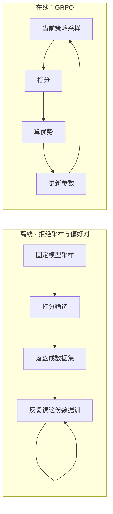

*图5：离线的循环在"训"这一格里打转，在线的循环把采样也圈了进去*

从图里该看出两件事：

1. **离线阶段模型学到的上限被数据钉死** ——数据是某一个时刻的模型采出来的。
   训到后面模型已经比那个时刻强了，但它读的还是那批旧样本。
2. **在线阶段每一步都重新采** ——所以它能往"当前模型写得出来的最好方向"再走一点。
   代价是每一步都要付完整的生成开销，慢一个量级。

### 6.4 采样参数配在哪

全在 `configs/train.yaml`：

| 参数 | 在哪一段 | 作用 |
| --- | --- | --- |
| `rollout_temperature` / `rollout_top_p` | `data` | 离线 rollout 的采样温度和核采样阈值 |
| `rollout_max_tokens` | `data` | 单条最大生成长度 |
| `pool_temperature` / `pool_top_p` | `data` | 建答案池时的采样参数 |
| `build_temperature` | `data` | 数据构建走贪心（0），让金标准可复现 |
| `temperature` / `top_p` / `max_completion_length` | `train.grpo` | 在线阶段的采样参数 |
| `group_size` | `train.grpo` | 一个 prompt 采几条，即组大小 K |

**温度必须高于 0。** 贪心采出来的 K 条几乎一模一样，组内没有差异，
"哪条更好"这个信号就不存在，后面的筛选和优势估计全是噪声。

**评测反过来，必须用贪心。** 采样会让同一个模型两次评测分数不一样，
阶段之间的差值就分不清是训练带来的还是这次采样抖出来的。

### 6.5 rollout 和参数更新是什么关系

离线阶段：rollout 产出的是**训练数据**，和参数更新之间隔着一次落盘和一轮筛选。
采样用的模型和被更新的模型是同一个，但采样发生在训练之前，一次性做完。

在线阶段：rollout 产出的是**这一步的训练批**。采样 → 打分 → 算优势 → 反传 → 更新 →
下一步用更新后的策略再采。采样和更新在同一个循环里，中间没有落盘。

rollout 讲完了，下面看采出来的东西怎么变成一个分数。

---

## 第7章 奖励函数

### 7.1 奖励由哪些部分组成

代码在 `src/rewards/grpo_reward.py` 的 `reward_one`。四层，从上到下依次判：

| 层 | 谁判的 | 判什么 | 不过会怎样 |
| --- | --- | --- | --- |
| 格式门 | 确定性规则 | 四个标签顺序对不对、think 够不够长 | 直接返回 `format_fail` |
| 答案门 | 确定性规则 | 答案的极性和数字还在不在认可池里 | 返回 `answer_out_of_pool` |
| 可比门 | 确定性规则 | 答案里有没有可抽取的事实槽位 | 返回 `answer_not_comparable` |
| 规则门 + 裁判 | 规则查检索腔；裁判给干净分 | 表面标记 + 换词复述程度 | 落到较低那一档基分 |

外加两个惩罚项：重复片段惩罚、超长惩罚。

**混合奖励，不是纯规则也不是纯模型。** 前三层全是确定性规则，零噪声、可逐条核对；
最后一层里"表面检索腔"仍是规则，只有"换词复述"交给大模型。分工的理由很简单：
规则判得了的绝不交给模型判——模型判有噪声、要花钱、还会被 hack。

### 7.2 为什么是词典序硬门，不是加权和

这是整条链路最重要的一个设计判断。

一个更省事的做法是加权和：`reward = 0.5×答案分 + 0.3×规则分 + 0.2×裁判分`。

这条路会**静默塌方**。裁判分的取值范围比另外两项宽（0~10 归一后 0~1，而答案分只有 0/1）。
模型很快会发现：把 think 写得极其漂亮，可以补偿答案上的一点漂移。于是它开始一边把 think
洗得越来越干净，一边慢慢改答案。

看训练曲线：干净分在涨，规则通过率在涨，在池率跌得很慢。**三个指标里两个在涨，一切正常。**
直到有人去读输出，才发现答案变了。

硬门把这条路堵死。这张图要说明的是四个档位的数值区间怎么排，以及为什么裁判分怎么加都翻不过身。

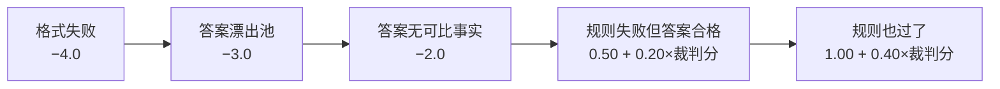

*图6：四档基分之间留出的间距，大于裁判分能贡献的最大幅度*

从图里该看出三件事：

1. **裁判分只在同一档内部排序** ——规则失败那一档最高能到 0.70，规则通过那一档最低是 1.00。
   裁判打满分也翻不过去。词典序靠数值区间保证，不靠额外的判断分支。
2. **负分区是不可补偿区** ——答案漂了就是负分，裁判连调都不调（省钱是顺带的，
   主要是不给它任何往上抬的机会）。
3. **只有前三道门全过才调裁判** ——这既省调用，也保证裁判的噪声永远不会把一个不合格的候选
   顶到合格候选之上。

### 7.3 "答案无可比事实"为什么单独一档

一条不含任何数字、极性的空话答案（"建议结合实际情况处理"），抽出来是空集合。
而**空集合是任何集合的子集**——不特判的话，它会被判成"没漂移"，白拿一个通过。

离线评测为了和历史口径可比，会把这类答案仍算进在池率的主指标，但在 `comparable` 字段上
单列出来审计。**在线训练不能这么放**：放过等于告诉模型"少说具体数字、别提金额和日期，
就能安全拿分"，恰好把 grounding 反向优化掉。

所以在线给它一个 `-2.0`——比"漂了"好一点（它至少没说错），但仍在负分区。

### 7.4 规则层判什么、挡不住什么

`src/rewards/rules.py` 里两个函数：

**`detect_rag_style`** 抓四类表面标记：检索装置腔（"参考问答对"、"资料显示"）、
编号引用（"问答对1"、"逐条对照"）、客服话术（"温馨提示"、"参考下图"）、图床附件（图片链接、文件名）。

外加一类特殊情形：**清单式甩文号**。判据是"这一句里没有任何推理词"或"一句里塞了三个以上文号"。

**这里有一条重要的豁免**：嵌进推理里的单个法规引用（"按《XX》的规定，这里适用 3%"）**不算痕迹**。
一个更省事的做法是所有法规引用都记一笔。那条路会把合法引用判成痕迹——而这类引用恰恰让答案更准。
硬按这个信号优化，模型学到的是"别引用法条"，grounding 跟着塌。

**规则挡不住什么**：换词复述。参考资料里写"月销售额未超过10万元的小规模纳税人免征增值税"，
模型写成"小规模纳税人这一档，月销售额不到10万的免增值税"——一个检索腔词都没有，规则完全看不见，
骨子里还是逐条搬运。**这正是裁判存在的唯一理由。**

**`answer_in_v1_pool`** 判答案漂移。抽三类事实：结论极性、关键数字、日期。三处归一化各有原因：

| 归一化 | 不做会怎样 |
| --- | --- |
| 长极性词优先命中并消位 | "不超过"会被拆出一个"超过"，一句话同时带上正反两个极性 |
| 万元 → 万、亿元 → 亿 | "10万"和"10万元"被判成两个不同的数字，凭空产生漂移 |
| 日期先抽并消位 | 期限正则会从"2023年1月1日"里抽出根本不存在的"1月"、"1日" |
| 日期按粒度前缀判覆盖 | 模型把日期说得更粗或更细都算漂 |

### 7.5 最终奖励是序列级还是 token 级

**序列级。** 一条完整生成拿到一个标量分数。这一点和 token 级奖励（每个 token 一个分）不同，
也是第 8 章要处理的核心问题：一个序列级的标量，怎么变成对每个 token 的梯度。

奖励算完之后，交给训练框架做两件事：组内标准化算优势，然后乘到每个 token 上。

### 7.6 抗 reward hacking 的两个补丁

硬门管的是"别改答案"和"别有表面检索腔"。模型仍然可以在这两条之内钻空子：

| 钻法 | 补丁 | 怎么算 |
| --- | --- | --- |
| 撞到最大长度后开始复读 | 重复片段惩罚 | 数 8/12/20 字片段的最高重复次数，超阈值扣分，封顶 0.8 |
| 把 think 写得又臭又长凑字数 | 超长惩罚 | 超出 `think_max_chars` 后按超出量线性扣，封顶 0.6 |

**这两项是补丁不是护栏。** 它们只处理已经见过的两种退化形态。真正的长度偏差和重复问题，
要靠评测时人去读样本才发现得了。

奖励讲完了，下面看这个标量怎么变成梯度。

---

## 第8章 优势与损失

### 8.1 优势从哪来

先说术语。**优势（advantage）** 回答一个问题：这条输出，比"通常能拿到的水平"好多少？

PPO 用一个专门训出来的价值模型（critic）来估"通常能拿到的水平"。GRPO 不用。
它的做法是：**同一个 prompt 采一组 K 条，拿这一组的均值当基准。**

```
A_i = (r_i − mean(r_1..r_K)) / std(r_1..r_K)
```

`r_i` 是第 i 条的奖励，`A_i` 是它的优势。

大白话：**同一道题采八条，谁比这八条的平均水平好，谁的概率被推高；谁比平均差，谁的概率被压低。**
不需要另外训一个模型来告诉你"这道题一般能拿几分"——同组的另外七条已经告诉你了。

### 8.2 组内标准化在哪配、为什么要除标准差

配置在 `train.grpo.scale_rewards`，值是 `group`，即每组各自减均值除标准差。

减均值是必须的：不减的话，"这道题本来就容易拿高分"会被当成"这条输出写得好"。
除标准差是为了跨题可比：有的题八条候选分数差很大，有的题八条几乎一样。
不除的话，前一类题的梯度会淹掉后一类。

**副作用**：一组八条全都拿同一个分数时，标准差是 0，优势全是 0，这一组对梯度没有贡献。
这不是 bug——这一组确实没提供任何"哪条更好"的信息。但如果长期大面积出现，
说明奖励函数区分不开当前的候选，该去查奖励设计而不是调学习率。

### 8.3 概率比、clipping、KL：这条链路各用了什么

| 机制 | 这条链路 | 说明 |
| --- | --- | --- |
| **概率比** | 用 | `π_new(token) / π_old(token)`，衡量这一步把这个 token 的概率改了多少 |
| **clipping** | 用（框架默认） | 把概率比裁到 `[1−ε, 1+ε]`，防止一步迈太大 |
| **KL 约束** | 用，系数是 `beta` | 拉住策略不要离参考模型太远 |
| **critic / GAE** | **不用** | GRPO 没有价值模型，优势直接由组内相对好坏得到 |

**KL 约束是什么、为什么要有它。** KL 散度衡量两个概率分布差多远。这里算的是当前策略和
参考模型在每个 token 上的分布差异，加进损失里当惩罚。

不要它会怎样：模型会为了多拿一点奖励，往一个离原模型很远的地方跑。跑远了之后，
奖励函数覆盖不到的那些维度（语法、连贯性、专业性）会一起退化——**奖励涨了，模型坏了。**

配置里 warmup 段的 `beta` 比 online 段大（0.08 对 0.06）。预热阶段要稳格式，收得紧一点；
在线阶段要让模型真的往前走，稍微放开。

### 8.4 一个序列级的分数，怎么落到每个 token 上

这是面试最常追问的一处，也是最能区分"理解了"和"只会调命令"的一处。

这张图要说明的是：从一组候选的奖励，到 think 段每个 token 的梯度，中间经过哪几步变换。

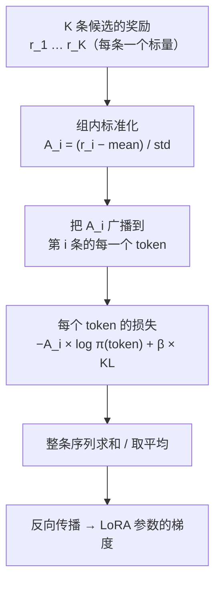

*图7：序列级的一个标量，经广播变成 token 级的梯度权重*

从图里该看出三件事：

1. **广播这一步就是答案** ——第 i 条序列的优势 `A_i` 是一个数，它被**原样乘到这条序列的
   每一个 token** 的对数概率上。写得好的那条，它所有 token 的概率一起被推高。
2. **模型没有被告诉"哪个 token 好"** ——它只知道"整条好"。所以强化学习需要一组候选来对比，
   靠"整条整条地比"间接推断出哪些写法更受欢迎。这也是为什么组大小 K 不能太小。
3. **answer 段的 token 也在里面** ——但因为 answer-lock，一组候选里 answer 段几乎相同，
   它们的优势差异主要由 think 段的差异造成。梯度实际压在 think 上。

**为什么一个序列级奖励可以影响整段输出。** 因为强化学习本来就不需要知道"哪个 token 好"。
它只需要"这条整体好"这个信号，配上足够多的对比样本。写得好的那条整条被推高，
写得差的那条整条被压低；重复多次之后，两条共有的部分互相抵消，剩下的差异部分——
也就是真正让它们分出高下的那几句——被留了下来。

### 8.5 DPO 那一步的损失长什么样

DPO 不需要 rollout，也不需要优势。它的损失直接建在一对偏好上：

```
L = −log σ( β × [ (log π(chosen) − log π_ref(chosen)) − (log π(rejected) − log π_ref(rejected)) ] )
```

大白话：**让"当前模型相对参考模型有多偏爱 chosen"，减去"当前模型相对参考模型有多偏爱 rejected"，
这个差值越大越好。** β 控制这件事推多用力。

减去参考模型那两项很关键：不减的话，模型可以靠"把 rejected 的概率压到极低"来降损失，
而 chosen 自己写得好不好完全没人管。

这条链路还额外开了 `rpo_alpha`——在偏好损失上再加一份 chosen 的负对数似然。理由同上：
只学"拉开差距"，chosen 那一侧的语言质量会塌。

### 8.6 参考模型在哪几处出现

| 出现在哪 | 干什么 |
| --- | --- |
| DPO 损失里 | 做上面那个减法，把"偏好"和"绝对概率"分开 |
| GRPO 的 KL 项里 | 算当前策略和它的分布距离，当惩罚项 |
| **不出现在** 数据构建里 | 数据是用当前阶段的模型采的，和参考模型无关 |

它在这条链路里始终是同一个东西：**本阶段起点的那个全量模型**（把新 LoRA 关掉即得）。

优势和损失讲完了，下面走一遍完整的更新。

---

## 第9章 一次参数更新的完整推演

> **下面所有数字都是教学示例，用来说清计算怎么走，不是任何一次真实实验的结果。**

### 9.1 一个 batch 长什么样

假设这一步取 2 个 prompt，组大小 K=4：

```text
prompt A：小规模纳税人本月销售额9万元，需要缴纳增值税吗？
prompt B：一般纳税人取得的普通发票可以抵扣进项税额吗？
```

采样后拿到 8 条候选（2 × 4）。

### 9.2 逐格算一遍

**第一格：奖励。** 每条过一遍 `reward_one`。

| 候选 | 格式 | 答案在池 | 规则 | 裁判分(0~10) | 奖励 |
| --- | --- | --- | --- | --- | --- |
| A-1 | 过 | 过 | 过 | 7.5 | 1.00 + 0.40×0.75 = **1.30** |
| A-2 | 过 | 过 | 过 | 5.0 | 1.00 + 0.40×0.50 = **1.20** |
| A-3 | 过 | 过 | **不过** | 不调 | 0.50 + 0 = **0.50** |
| A-4 | 过 | **不过** | — | 不调 | **−3.00** |
| B-1 | 过 | 过 | 过 | 6.0 | **1.24** |
| B-2 | 过 | 过 | 过 | 6.5 | **1.26** |
| B-3 | 过 | 过 | 过 | 5.5 | **1.22** |
| B-4 | **不过** | — | — | 不调 | **−4.00** |

**第二格：组内优势。** A 组四条：`[1.30, 1.20, 0.50, −3.00]`，均值 −0.0，标准差约 1.94。

| 候选 | 奖励 | 优势 |
| --- | --- | --- |
| A-1 | 1.30 | +0.67 |
| A-2 | 1.20 | +0.62 |
| A-3 | 0.50 | +0.26 |
| A-4 | −3.00 | **−1.55** |

B 组四条：`[1.24, 1.26, 1.22, −4.00]`，那条格式失败的拿到一个很负的优势，另外三条都是小正数。

这里能看出两件事：**A-4 那条答案漂了的，优势是显著的负数，它整条序列的概率会被压低**；
而 A-1 到 A-3 三条虽然质量有差别，优势都是小正数——它们之间的排序信息也在，只是幅度小。

**第三格：token 损失。** A-1 的优势 +0.67 被乘到它 think 段和 answer 段的每一个 token 上。
假设 A-1 有 180 个 token，那就是 180 个位置各自算 `−0.67 × log π(token)`，再加各自的 KL 项。

**第四格：梯度累计。** 配置里 `train.grpo.gradient_accumulation` 是 8，
每张卡 `per_device_batch_size` 是 1。8 张卡的话，一次 `optimizer.step()` 之前累了
`1 × 8 × 8 = 64` 条序列的梯度。

**第五格：更新。** `optimizer.step()` → `zero_grad()` → 下一步用更新后的策略重新采样。

### 9.3 完整时序

这张图要说明的是一步在线更新里，采样、打分、反传三件事的先后和阻塞关系。

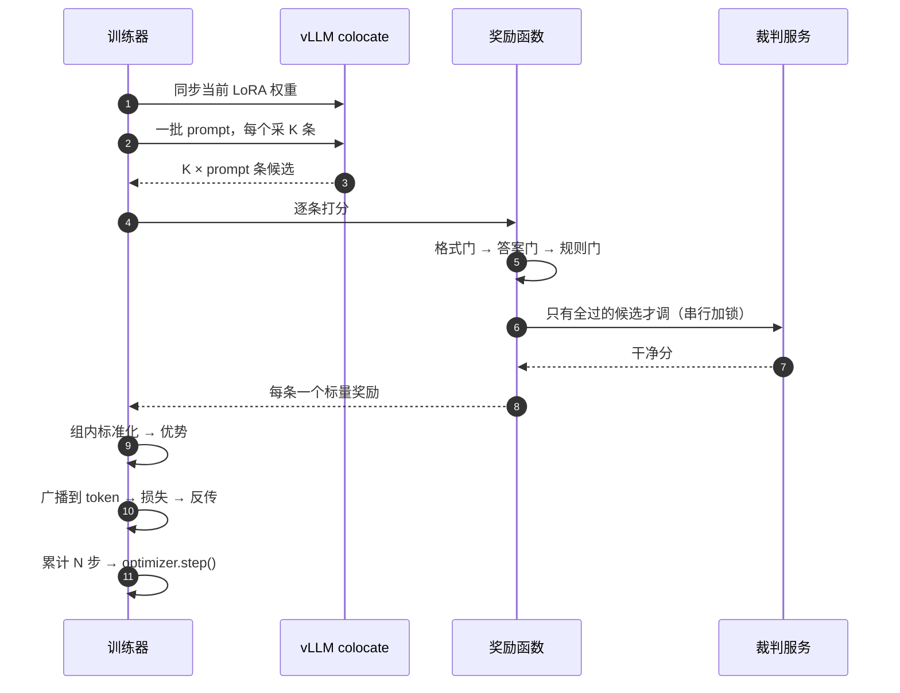

*图8：一步在线更新里，采样和打分是串在训练前面的，两者都阻塞*

从图里该看出三件事：

1. **权重同步在最前面** ——不同步的话，采样用的是上一步的策略，算出来的概率比就是错的。
2. **裁判调用被一把锁串起来** ——多个分布式 worker 同时打，几乎必然触发限流，
   然后一起退避一起重试，把训练卡在那里。
3. **只有安全区内的候选才走到裁判那一格** ——图里那条分支不是优化，是设计：
   不合格的候选不给它任何被裁判抬上去的机会。

### 9.4 这一次推演说明了什么

| 现象 | 揭示了什么 | 为什么重要 |
| --- | --- | --- |
| A-4 拿到 −1.55 的优势 | 硬门的负分直接翻译成"整条被压低" | 答案漂移不是扣一点分，是整条被否 |
| A-1 到 A-3 优势都是小正数 | 同一档内部裁判分只造成小幅排序 | 裁判的噪声不会造成大的梯度扰动 |
| B-4 格式失败拿到最负的优势 | 格式在最底层 | 模型先学会把标签写对，才谈得上写好 |
| 一次 step 累了 64 条序列 | 有效批量靠累计凑，不靠单卡 batch | 32B 单卡放不下大 batch，只能这么凑 |

更新讲完了，下面看这些东西怎么塞进有限的显存里。

---

## 第10章 显存与分布式

### 10.1 每个组件省的是哪一部分

| 组件 | 省什么 | 代价 |
| --- | --- | --- |
| **LoRA** | 优化器状态和梯度（只有千分之几的参数要优化器状态） | 表达力受秩限制 |
| **bfloat16 混合精度** | 权重和激活值各省一半 | 数值范围比 fp32 窄，极端情况要注意溢出 |
| **梯度检查点** | 激活值。前向不存中间激活，反传时重算 | 多一次前向，慢约三成 |
| **DeepSpeed ZeRO-3** | 参数、梯度、优化器状态全都切到各卡上 | 通信量大，前向反传时要 all-gather 参数 |
| **梯度累计** | 峰值激活值（单步只跑一小批） | 一次 step 的墙钟时间变长 |
| **模型 / 优化器 offload** | 非活跃时把它们挪到 CPU 内存 | 搬来搬去的带宽开销 |
| **FlashAttention / SDPA** | 注意力的中间矩阵（不物化 N×N） | 需要硬件和算子支持 |

这条链路的注意力实现用 `--attn_impl sdpa`（PyTorch 自带的缩放点积注意力，
在支持的硬件上会走 FlashAttention 内核）。

这张图要说明的是：显存被四类东西占着，上面那七个组件分别按在哪一类上——
知道这个分类，遇到 OOM 才知道该动哪个开关。

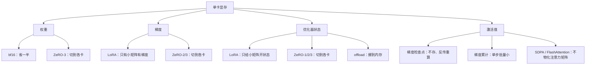

*图9：四类显存占用，和各自对应的开关*

从图里该看出三件事：

1. **LoRA 一次动了两类** ——梯度和优化器状态。这是它省得最多的地方，也是为什么
   32B 上 LoRA 几乎是必选而不是可选。
2. **ZeRO 横跨三类** ——阶段号就是"切到第几类为止"。切得越多越省，通信越多。
3. **激活值只能靠"少存"和"不物化"** ——它和序列长度、批量大小成正比，
   所以长文本任务里它经常是最后那个压不下去的。OOM 发生在生成变长之后，
   通常就是这一类。

### 10.2 梯度累计怎么影响一次更新

一个直觉误区：梯度累计只是"省显存的技巧"。

实际上它改变的是**有效批量**：

```
有效批量 = per_device_batch_size × 卡数 × gradient_accumulation
```

配置里 `per_device_batch_size=1`、`gradient_accumulation=8`，八张卡的话有效批量是 64。

这有两个直接后果。第一，学习率要按有效批量调，不是按单卡 batch。第二，一轮的**优化步数**
等于 `样本数 / 有效批量`——冷启动集在千条量级、有效批量 64 的话，一轮只有十几步。
所以那一步的轮数配到 7，不是因为要过拟合，是因为不这么配总步数根本不够。

**换了样本量就要重新折算**，不能照抄轮数。

### 10.3 colocate 模式下那五个开关

在线 GRPO 里推理引擎和训练器住在同一批卡上。显存必须精打细算，`configs/train.yaml` 的
`train.grpo` 段里那五项缺一不可：

| 开关 | 值 | 管什么 |
| --- | --- | --- |
| `vllm_gpu_util` | 0.5 | 推理引擎最多占一半显存，另一半留给训练 |
| `move_model_batches` | 16 | 权重同步分批搬，不要一次性拷整个模型 |
| `sleep_level` | 1 | 采样间隙让推理引擎释放显存 |
| `offload_model` | true | 非活跃时把模型挪到内存 |
| `offload_optimizer` | true | 优化器状态同上 |

外加一条：推理侧的张量并行度要对齐训练进程数。两套并行切分不一致会打架。

**任何一项放松都可能在几十步之后炸**，而不是第一步就炸——显存碎片是慢慢累积的。
所以这几项调之前要先想清楚为什么。

### 10.4 多卡启动方式

训练侧：

```bash
CUDA_VISIBLE_DEVICES=0,1,2,3,4,5,6,7 NPROC_PER_NODE=8 swift sft ... --deepspeed zero3
```

`NPROC_PER_NODE` 就是卡数，ms-swift 内部起 torch 分布式。

推理侧（离线服务）：

```bash
CUDA_VISIBLE_DEVICES=0,1 vllm serve <模型目录> --tensor-parallel-size 2
```

卡数即张量并行度。

**两侧不能同时占卡。** 编排器在每次训练前按进程组停掉推理服务，
并且轮询确认端口真的空了才往下走。

显存讲完了，下面看怎么判断这些训练到底有没有用。

---

## 第11章 评测：三件套与真涨门

### 11.1 checkpoint 怎么进评测

```
LoRA adapter → merge_lora.sh 合并回基座 → 全量模型目录
             → serve_vllm.sh 起服务，起一个名字
             → evaluate.py --tag X --served-name X
```

**那个名字是语义开关，不是标签。** `src/data/prompts.py` 的 `system_for` 按这个名字决定
套哪套 system 提示：基座要用它原生的 RAG 腔还原真实行为，训练后的模型要用中性提示、和训练数据对齐。

搞反了分数会全错，而且**错得看不出来**——模型照样能生成，只是腔调被提示词拉回去了。

### 11.2 评测数据怎么进、结果怎么存

输入是冻结验收集（`01_eval.jsonl`），全程贪心（温度 0）。

输出四份：

| 文件 | 内容 | 谁读 |
| --- | --- | --- |
| `<tag>_infer.jsonl` | 每题的生成原文、切好的 think/answer、格式标记 | 人工抽查 |
| `<tag>_scores.jsonl` | 每题的三件套逐条判分 | 定位是哪些题拉低了分 |
| `<tag>_report.md` | 人读报告，每个数字带"谁评的 + 样本量" | 人 |
| `<tag>_summary.json` | 机读摘要 | 阶段门、`--compare` |

### 11.3 三件套：为什么必须是三个

这张图要说明的是：三个指标各自能被怎么刷高，以及为什么只有真把推理写好才能同时推高三个。

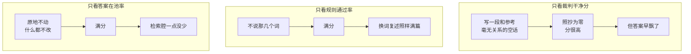

*图10：每个指标单独看都能被一个廉价策略刷满*

从图里该看出两件事：

1. **三个指标的失效方式互不相同** ——干净分被"什么都不说"刷，规则被"换个说法"刷，
   在池率被"什么都不做"刷。刷任何一个的策略，都会让另外两个塌。
2. **一个工具只判一件事** ——干净分只由裁判判，检索腔和答案漂移只由规则判。
   不让规则去判照抄（它判不了），也不让裁判去判答案漂移（它有噪声而规则没有）。

### 11.4 真涨门：什么叫"确实涨了"

裁判打分有噪声。同一段推理打两遍，分数会不一样。所以两个阶段的均值差**必须过一个门**
才敢说涨了。

门是这么来的：

```
SE = √(σ_between² + σ_judge²/k) / √N
真涨门 = 3 × SE
```

两项的分工是关键：

- **σ_judge** 是裁判自己的手抖，同一段推理反复打分的差异。打 k 遍能压到 `σ_judge/√k`。
- **σ_between** 是题与题之间的真实差异，有的题就是好写、有的题就是难写。**k 压不掉它。**

直接后果：**k 从 3 加到 16，标准误几乎不动，钱白花。** 要把判据收紧只能加题数 N。
这条结论有一条单元测试钉着（`tests/test_schema_and_calibration.py`）。

差值小于门限 = 读不出来 = 两个阶段按**统计打平**记，不许说谁更好。这不是谦虚，
是不这么记就会拿噪声当成果。

### 11.5 那张 σ 标定表是怎么来的

`configs/train.yaml` 的 `calibration` 段有六档，每档两个数：该档的分数均值、该档的档内标准差。

做法：造一批照抄程度已知的推理段——同一道题的参考资料，按"抄 0 句 / 1 句 / 2 句 / 3 句 /
4 句 / 整段抄"造六档，每档若干条，让裁判对每一条各打 16 遍。16 遍的均值就是该档的分数，
16 遍的标准差就是该档的档内噪声。

**表里最要紧的一条信息**：越靠近"完全没照抄"这一端，标准差越大。也就是说，
两段都挺干净的推理，裁判分不太开。这条直接决定了偏好对的造法——chosen 和 rejected
必须是"洗干净的"对"基座原推理"，不能是"洗干净的"对"稍微没那么干净的"，
后者落在裁判分不开的区间里，学出来的是噪声。

**这张表挡不住什么**：裁判的系统性偏差。它量的是方差，不是偏差。裁判如果对某类题材
一律偏高或偏低，表里看不出来，得换一批标定样本才测得到。

### 11.6 训练前后怎么比

```bash
python scripts/evaluate.py --compare rft dpo
```

输出会把三个指标的前后值、差值、以及干净分那条的真涨门一起打出来，
并直接给出"真涨 / 真降 / 统计打平"的判读。

另外两个指标是确定性的，没有打分噪声，直接比数就行——所以不对它们套统计判据。

评测讲完了，下面把工程上真正难的几处单列出来。

---

## 第12章 工程难点

这一章只写这条链路的代码里真实存在的问题，每条都能指到具体文件。

### 12.1 训练和采样抢同一批 GPU

**问题**：离线采样要一个常驻推理服务占着卡；训练和合并要卡是空的。

**做法**：编排器在每次训练前显式停服务，按**进程组**停（张量并行会拉起一堆 worker，
只 kill 主进程的话 worker 还占着显存），停完轮询确认端口真的空了才往下走。
代码在 `src/training/pipeline.py` 的 `stop_vllm`。

**留下的边界**：如果有编排器之外的进程占着卡，它停不掉，只能报错让人处理。

这张图要说明的是一个阶段从建数据到评完，卡在谁手里是怎么交替的。

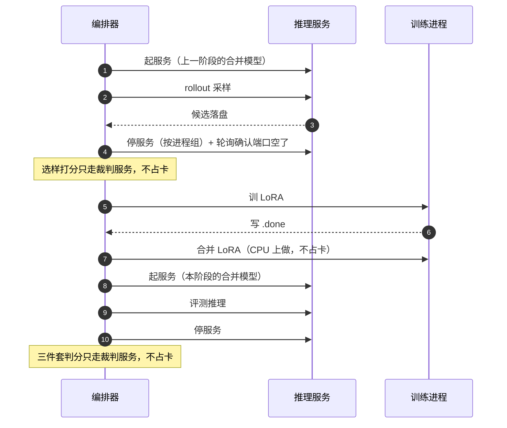

*图11：一个阶段里，卡在推理服务和训练进程之间来回交接四次*

从图里该看出三件事：

1. **每次交接都必须显式停服务** ——不是等它自己退。张量并行拉起的 worker 子进程
   不会跟着主进程一起走，得按进程组停。
2. **停完还要轮询确认** ——发了信号不等于显存已经还回来了。不确认就往下走，
   训练会在加载权重那一步 OOM，而报错位置在框架深处，看不出是资源冲突。
3. **两段打分都不占卡** ——选样打分和评测判分都只走裁判服务的网络调用。
   把它们排在"服务已停、训练未起"这个窗口里，卡是空着的，这段时间可以并行做别的。

### 12.2 断点续跑：怎么区分"没产出"和"产出了但是空的"

**问题**：选样一条都没选中是**合法结果**，会写出一个 0 字节文件；进程被 kill 也会留下
不完整的文件。两者用文件大小分不开。

**做法**：每一步整步成功才写一个 `.done` 标记，续跑只认标记。
LoRA 训练同理——**绝不用 glob `adapter_config.json` 来判断训完没有**：
训练每个 epoch 都落一个 checkpoint，中途崩溃会留半成品，glob 会把半成品当成"已训完"
跳过训练，拿一份没收敛的权重进下游。

### 12.3 奖励函数的模块化

**问题**：同一套判定要在三个地方用——训练选样的硬门、在线奖励、离线评测指标。
三处各写一套，口径一漂，训练信号和成绩单会一起错，而且**错得一致，看不出来**。

**做法**：规则层只实现一次（`src/rewards/rules.py`），三处都调它。
在线奖励和离线评测的差别只有一处，而且这处差别是**刻意的**并写在注释里：
"答案无可比事实"离线放过（保历史可比），在线判负分（防 grounding 被反向优化）。

### 12.4 长文本的显存控制

**问题**：think 段可以写得很长。生成长度直接决定激活值大小和 KV cache 占用。

**做法**：三层。生成侧 `max_completion_length` 硬截断；奖励侧超长惩罚软扣分；
训练侧 `max_length` 截断样本。

**软硬结合的理由**：只做硬截断会把"这道题确实要多推两步"的样本一刀切掉；
只做软惩罚拦不住显存峰值。

### 12.5 checkpoint 管理

**问题**：五个阶段，每个都产一个全量模型，每个都是一份完整基座大小。

**做法**：合并时先写 `.partial`，校验 config 和权重分片都在，才改名成正式目录。
中途被 kill 只留下一个 `.partial`，不会留下一个"看起来是完整模型、其实少几个分片"的目录——
后者会被下游当成可用模型直接加载，报的错还全是权重形状不匹配。

**不自动删任何东西**。几十 G 的东西删错一次，代价是几十分钟重跑。
残留一律改名保留，由人决定。

### 12.6 数据格式一致性

**问题**：同一道题在链路里跨五六个文件流转，中途会去重、洗牌、早停。

**做法**：用 `sha1(query)[:12]` 当主键，全链路对齐。行号在这条链路里从第二步起就没意义了。

### 12.7 训练和评测复用同一套解析

**问题**：数据构建要容错（尽量捞出内容），评测要严格（残缺就是残缺）。

**做法**：两个函数并存，用途在 docstring 里写死，并有单元测试钉住两者的差别
（`tests/test_evaluation.py`）。合并成一个的诱惑很大，合并了会让评测指标虚高。

### 12.8 外部服务的限流与预算

**问题**：判分要打成千上万次，服务容易 429；而且花钱。

**做法**：三件。判分并发压得很低（并发一高就变成"一起退避一起重试"，反而更慢）；
重试前换新连接（服务抖动会让旧连接池里的 socket 坏掉，复用它只会一直等）；
在线阶段额外加一把跨进程文件锁把多个 worker 的调用串起来。

预算围栏是一个继承 `BaseException` 的异常——继承 `Exception` 会被判分路径上到处都是的
`except Exception` 容错分支静默吞掉，围栏就成了摆设。

工程难点讲完了，下面是面试会追问的那些。

---

## 第13章 面试高频追问

每条都写成可以直接读出来的样子。答不上来的地方直说没有数据，不编。

### 13.1 为什么强化学习需要 rollout

> 因为强化学习没有标准答案，只有一个打分函数。监督微调是"照着这条标准答案学"，
> 直接算交叉熵就行；强化学习是"你先写一个，我告诉你好不好"。要拿到这个"好不好"，
> 就必须先让模型自己写出来。所以 RL 的每一步都比 SFT 多一轮完整的生成开销，
> 这也是它慢一个量级的根本原因。

### 13.2 reward 和 loss 是什么关系

> reward 是对**一条完整输出**打的一个标量分，它本身不能求导——奖励函数里有正则匹配、
> 有外部 API 调用，跟模型参数没有可微的连接。
>
> loss 是用这个分数**加权**出来的可求导目标。具体是：先把一组候选的 reward 标准化成优势，
> 再把优势乘到这条序列每个 token 的对数概率上。梯度从对数概率那里流回参数，
> reward 只是一个系数。

### 13.3 advantage 到底在做什么

> 它回答"这条比通常水平好多少"。直接用 reward 当权重会有一个问题：有的题本来就容易拿高分，
> 有的题本来就难。不减基准的话，模型会把"这道题容易"学成"这条写得好"。
>
> 这条链路用 GRPO，基准就是同组另外 K−1 条的均值。同一道题采八条，谁比这八条的平均好，
> 谁的概率被推高。

### 13.4 GRPO 和 PPO 的区别

> 最核心的区别是**优势怎么来的**。PPO 训一个价值模型来估"这个状态通常能拿几分"，
> 再用 GAE 算优势。GRPO 不训价值模型，同一个 prompt 采一组，用组内均值当基准。
>
> 省的是一整个和策略同量级的模型——对 32B 来说，那意味着少一份权重、少一份优化器状态、
> 少一轮前向。代价是每个 prompt 必须采一组，采样开销涨 K 倍，而且优势估计的方差
> 依赖组大小。
>
> clipping、KL 这些机制两边是一样的。

### 13.5 为什么不用 PPO

> 资源和收益不匹配。32B 再加一个同量级的价值模型，显存和实现复杂度都上一个台阶；
> 而这条链路的奖励是"一条输出好不好"的整体判断，本来就没有中间步骤的价值可估——
> 用组内相对好坏就够了。

### 13.6 reference model 是干什么的

> 拉住策略不要跑太远。它在两个地方出现：DPO 损失里做减法，把"偏好"和"绝对概率"分开；
> GRPO 里算 KL 惩罚。
>
> 这条链路的参考模型不需要额外加载：每个阶段的起点是一个全量模型，训的是一个全新的 LoRA，
> 把这个 LoRA 关掉就正好是冻结的起点。省一份权重，而且不存在"参考模型包不包含旧 adapter"
> 这种含糊。

### 13.7 KL 约束不要会怎样

> 模型会为了多拿一点奖励，往一个离原模型很远的地方跑。跑远之后，奖励函数覆盖不到的那些
> 维度会一起退化——语法、连贯性、专业性。结果是**奖励涨了，模型坏了**。
>
> 系数在配置里叫 beta。这条链路的预热段给 0.08、在线段给 0.06：预热要稳格式收得紧，
> 在线要让模型真往前走，稍微放开。

### 13.8 一个序列级的奖励，怎么更新到每个 token

> 优势是一个标量，它被**原样广播到这条序列每一个 token** 的对数概率上。
> 写得好的那条，所有 token 的概率一起被推高。
>
> 模型没有被告诉"哪个 token 好"，它只知道"整条好"。所以强化学习需要一组候选来对比：
> 好的整条推高、差的整条压低，重复多次之后，两条共有的部分互相抵消，
> 剩下真正让它们分出高下的那几句被留下来。

### 13.9 RL 和 SFT 的边界在哪

> SFT 的监督信号是"照着这条写"，目标是外部给的。RL 的监督信号是"你写的这条值几分"，
> 目标是模型自己采出来的。
>
> 中间有一个灰色地带：拒绝采样。它的数据是模型自己采、用奖励函数筛出来的，
> 但训练方式仍是交叉熵，没有"按奖励调每个 token 概率"这一步。所以我把它算 RL 的前奏，
> 不算 RL。这条边界最好主动说清楚，不然容易被追问到含糊的地方。

### 13.10 为什么不能只用 SFT

> 三个理由，按重要性排。
>
> 第一，**没有老师**。这个领域没有比基座更强的模型，SFT 需要的高质量目标从哪来？
> 冷启动那批是裁判模型写的，但裁判模型不懂这个领域的专业判断，它只会写得自然，
> 保不了 grounding。
>
> 第二，**SFT 学不到"什么更差"**。它只见过好样本，不知道边界在哪。偏好学习才第一次告诉
> 模型"这个比那个好"。
>
> 第三，**SFT 的上限被数据钉死**。在线阶段每一步用当前策略重新采样，模型能往它当前
> 写得出来的最好方向再走一点，这件事 SFT 做不到。

### 13.11 32B 的显存怎么处理

> 五件事叠起来：LoRA 只训千分之几的参数，省掉优化器状态和梯度；bf16 混合精度权重激活各省一半；
> 梯度检查点不存中间激活、反传时重算，拿三成的速度换显存；DeepSpeed ZeRO-3 把参数、梯度、
> 优化器状态全切到各卡；梯度累计让单步只跑一小批。
>
> 在线阶段还多一层：推理引擎和训练器共卡，所以要限推理侧显存比例、权重同步分批搬、
> 采样间隙释放显存、非活跃时 offload 到内存。

### 13.12 ZeRO 三个阶段各切什么

> ZeRO-1 切优化器状态，ZeRO-2 再切梯度，ZeRO-3 连参数也切。切得越多显存越省，
> 通信越多——ZeRO-3 前向反传时要把参数 all-gather 回来。
>
> 这条链路用 ZeRO-3，因为 32B 的参数本身就装不下单卡。

### 13.13 梯度累计怎么影响一次更新

> 它改变的是**有效批量**：单卡 batch × 卡数 × 累计步数。这条链路是 1 × 8 × 8 = 64。
>
> 两个后果。学习率要按有效批量调，不是按单卡 batch。一轮的优化步数等于
> 样本数除以有效批量——冷启动集在千条量级、有效批量 64 的话，一轮只有十几步，
> 所以那一步的轮数配得比较大。换了样本量要重新折算，不能照抄轮数。

### 13.14 LoRA 的秩和 alpha 怎么定

> 秩是低秩矩阵的中间维度，决定表达力上限；alpha 是缩放系数，LoRA 那一支的输出乘 alpha 除以秩。
> 这条链路用 16 和 32，即放大两倍。
>
> 这两个值我没有做过消融，用的是常见的起点配置。要说清楚的是它挂在哪：注意力的四个投影
> 加 MLP 的三个，七个矩阵。只挂注意力也能训，但表达力会更受限。

### 13.15 训练不稳定怎么排查

> 按从便宜到贵的顺序查。
>
> 先看**奖励分布**：一组八条如果奖励全一样，优势全是 0，这一组对梯度没有贡献。
> 大面积出现说明奖励函数区分不开当前候选，该去查奖励设计而不是调学习率。
>
> 再看**格式失败率**：刚从偏好学习切到在线采样时它会短暂抬头，一直不降说明采样参数
> 或最大长度有问题。
>
> 再看 **KL**：涨得太快说明 beta 给小了，模型在往外跑。
>
> 最后才是学习率。在线阶段的学习率比监督微调小两三个数量级，调之前先确认前面三项没问题。

### 13.16 什么是 reward hacking，这条链路怎么防

> 模型找到一条"能把分刷高但没有真正做好任务"的捷径。
>
> 这条链路防了三层。**第一层是硬门**：奖励是词典序不是加权和，答案漂了就是负分，
> 推理写得再好也补不回来。加权和那条路会静默塌方——三个指标里两个在涨，
> 一个跌得很慢，看曲线一切正常。
>
> **第二层是"答案无可比事实"单独判负**。不判的话模型会学到"少说具体数字就能安全拿分"，
> 恰好把 grounding 反向优化掉。
>
> **第三层是三件套评测**。三个指标的失效方式互不相同，刷任何一个的策略都会让另外两个塌。

### 13.17 长度偏差怎么处理

> 两层。生成侧硬截断 max_completion_length；奖励侧超出字数上限后按超出量线性扣分、封顶。
>
> 软硬结合的理由：只做硬截断会把"这道题确实要多推两步"的样本一刀切掉；
> 只做软惩罚拦不住显存峰值。
>
> 要说清楚的是这只是补丁，不是护栏。真正的长度偏差要靠评测时人去读样本才发现得了。

### 13.18 怎么保证训练和评测隔离

> 验收集在切分那一刻就冻结，固定条数、固定种子，全程不参与任何训练和选样。
>
> 代码层面有两道锁：自采样只能读**仅训练题集**那份文件；在线 GRPO 的数据组装里
> 有一条硬检查，验收题的主键一旦出现在训练数据里就直接退出，不是警告。
>
> 为什么是硬失败：在线训练会把同一道题反复采几十次，一旦泄漏，后面所有评测数字都不作数，
> 而且从曲线上完全看不出来。

### 13.19 裁判模型的噪声怎么处理

> 先量再用。开训之前造一批照抄程度已知的推理段，分六档，每档让裁判各打 16 遍，
> 量出每档的均值和档内标准差。
>
> 这张表有两个用途。选样时判"这条真的比那条干净吗"——要求两条的误差带完全错开，
> 不是简单比大小。评测时算真涨门——两个阶段的均值差要过三倍标准误才算涨。
>
> 表里最重要的一条信息是：越靠近"完全没照抄"这一端方差越大。所以偏好对必须是
> "洗干净的"对"基座原推理"，不能是两条都挺干净的——后者落在裁判分不开的区间里。

### 13.20 为什么评测的 k 只有 3，选样却要 16

> 因为两者的瓶颈不同。
>
> 评测算的是**整体均值**，它的标准误是 √(σ_between² + σ_judge²/k) 除以 √N。
> σ_between 是题与题之间的差异，k 压不掉它。所以 k 从 3 加到 16，标准误几乎不动，钱白花。
> 要收紧只能加题数。
>
> 选样是**逐条判断**，要套那张按 16 遍量出来的标定表。k 小了，裁判自身的噪声没被 √k 压掉，
> 判据实际比声称的松，而日志上完全看不出来。所以代码里那一处写了断言，k 小于 16 直接报错。

### 13.21 数据量不够怎么办

> 这条链路的每个阶段都有一个"攒够就停"的目标数，而不是跑满全池。实现上是先固定种子洗牌
> 再分批跑，够了就停——这样早停拿到的是**随机代表子集**，不是"题库前 N 条"。
>
> 如果找遍全池还是不够，代码会打警告然后用现有的继续训，不报错。因为"选样门一条都没选中"
> 是合法结果，不是故障。

### 13.22 这个项目怎么迁移到 Agent 或 RAG 场景

> 可以直接搬的有三样。
>
> **一是"先量尺子再优化"**。任何用大模型当裁判的地方都适用：Agent 的轨迹评分、
> RAG 的答案相关性打分，都要先测它的重测一致性，再决定判据要多严。
> 不量就选样，选进来的一半是噪声。
>
> **二是词典序硬门**。Agent 的奖励天然是多目标的——任务完成、工具调用正确、不乱花钱。
> 这些目标不该加权和，该排序：工具调用错了，任务"完成"了也不算。
>
> **三是"锁死一部分、只优化另一部分"**。这条链路锁答案只训推理；换到 RAG 里可以锁引用
> 只优化组织方式，换到 Agent 里可以锁工具参数只优化决策顺序。

### 13.23 这个项目体现了哪些 AI 应用开发能力

> 四块。
>
> **端到端链路搭建**：从原始语料到可评测的模型，七个数据步、四个训练阶段、
> 一套评测，三个入口一份配置。
>
> **可观测和可恢复**：每一步整步成功才写完成标记，中断重跑同一条命令即可；
> 状态文件让人在另一个终端就能看到跑到哪、该看哪个日志。
>
> **外部服务治理**：限流退避、连接池重建、跨进程锁、去重缓存、预算围栏。
> 这些和做 Agent 时调外部 API 是同一套问题。
>
> **测量意识**：知道哪个指标有噪声、噪声多大、什么样的差值才叫真涨。
> 这一条在做任何 LLM 应用的效果评估时都是同一件事。

### 13.24 这条链路你觉得哪里还不够好

> 三处。
>
> 第一，**裁判的系统性偏差没测**。标定表量的是方差，不是偏差。裁判如果对某类题材一律偏高，
> 表里看不出来，得换一批标定样本才测得到。
>
> 第二，**LoRA 的秩和 alpha 没做消融**，用的是常见起点配置。
>
> 第三，**长度和重复的惩罚是补丁**，只处理了已经见过的两种退化形态。
> 更彻底的做法是把长度也纳入评测指标，而不是只在奖励里扣分。

追问答完了，下面把这些内容压成简历上能写的几行。

---

## 第14章 简历表达

### 14.1 项目标题

> **32B 领域模型推理过程强化学习改造 · 四阶段自我改进训练链路**

### 14.2 三条项目描述

> **搭建 32B 模型四阶段强化学习训练链路（冷启动 SFT → 拒绝采样 → DPO → 在线 GRPO），
> 基于 ms-swift + DeepSpeed ZeRO-3 + LoRA + vLLM，实现从数据构建、训练编排到离线评测的
> 端到端可复跑流程，全链路支持断点续跑。**

> **设计词典序硬门奖励函数并接入 GRPO：格式、答案漂移、检索腔三道确定性规则门在前，
> 大模型裁判只在安全区内做组内排序，从机制上堵死"推理写得漂亮补偿答案漂移"这条
> reward hacking 路径。**

> **建立可量化的评测口径：开训前先标定裁判的分辨率，量出逐档打分噪声，据此定义
> σ-可分选样门与 3×SE 真涨门；评测采用规则加大模型的三指标交叉验证，
> 使任何单一指标都无法被廉价策略刷高。**

### 14.3 三十秒口述版

> 这个项目是在一个 32B 领域模型上做四阶段强化学习，把它的推理过程从检索腔改造成自然推导，
> 同时锁死答案不漂移。约束是不能蒸馏，所以只能让模型自己采样、自己筛、再训自己。
>
> 我负责整条链路：数据构建、四阶段训练编排、奖励函数设计、评测口径。
> 里面我自己最认的两个设计，一个是 answer-lock——训练样本的答案段永远拼基座原版，
> 只训推理段，梯度就不会串到答案上；另一个是词典序硬门奖励，答案漂了就是负分，
> 推理写得再好也补不回来。
>
> 做完这个项目，整条 RL 训练链路从数据到参数更新每一环在做什么、为什么这么设计，
> 我都能讲到代码级。

### 14.4 "你在项目中负责什么"

> 整条链路是我搭的，四块。
>
> **数据侧**：原始语料的清洗切分、基座认可答案池的构建、四个训练阶段各自的数据构造。
> 这里最花心思的是三道门的排列顺序，以及"改写时不喂原推理"这个决定——直接喂原推理，
> 改出来的稿子会锚死在原文措辞上，判分天花板压死整批数据。
>
> **训练侧**：四个阶段的编排，包括 GPU 互斥的起停、断点续跑、每阶段的合并和阶段门。
> 在线 GRPO 那一段的 colocate 显存配置也是我调的。
>
> **奖励侧**：确定性规则层（检索腔标记、答案漂移判定）和在线奖励函数。
> 词典序硬门这个设计是我定的，理由是加权和会静默塌方。
>
> **评测侧**：开训前的裁判标定实验，以及三件套评测口径和真涨门判据。
> 这一块我觉得是这个项目最能复用到别处的部分——任何用大模型当裁判的场景，
> 都该先量它的噪声再决定判据。

表达方式定完了，下面把"这些话我凭什么敢说"这件事亮出来。

---

## 动手验证

这一节验的是：规则层的判定口径、奖励函数的词典序、以及标定判据这三样，
在**不连任何外部服务**的情况下是不是还成立。

```bash
python -m pytest -q
```

输出（本机真实运行结果，非手写）：

```text
.................................................                        [100%]
49 passed in 0.15s
```

**该看出这几件事**

1. **全部 49 条用例不连任何服务** ——没有推理服务、没有裁判服务、没有 GPU。
   规则层和奖励函数的硬门部分本来就是纯 CPU 的确定性逻辑，这一点让它们可以被钉住。
2. **词典序有专门的用例守着** ——`tests/test_grpo_reward.py` 里那条
   `test_lexicographic_order_holds` 直接断言四档严格递减。有人把奖励改成加权和，这条会红。
3. **"加 k 没用"这个结论也有用例守着** ——`test_more_repeats_barely_help_the_overall_standard_error`
   断言 k 从 3 到 16 标准误变化不到一成。有人想靠调大评测的 k 来收紧判据，这条会提醒他。
4. **answer-lock 有用例守着** ——断言一对偏好数据的答案段逐字相同。

想看具体是哪些断言，直接读 `tests/` 下那五个文件，每条用例的 docstring 都写了它在防什么。

> 这个脚本演示的是**第 ① 档（离线用例）**：它能证明"这段代码的行为就是这样"，**不能**证明
> "接上真模型效果好"。三档口径见 [README](../README.md)。

---

## 第15章 小结

### 15.1 这一节实现了什么

| 文件 | 内容 |
| --- | --- |
| `src/data/schema.py` | 三种训练格式的拼装，answer-lock 在这里落地 |
| `src/data/prompts.py` | 两套 system 提示、改写提示词、结论锚点拼装 |
| `src/data/selection.py` | 拒绝采样和偏好对共用的三道门选样逻辑 |
| `src/rewards/rules.py` | 检索腔表面标记 + 答案漂移判定，零噪声 |
| `src/rewards/calibration.py` | σ 标定表、σ-可分判据、评测标准误、真涨门 |
| `src/rewards/grpo_reward.py` | 在线奖励函数，词典序硬门 |
| `src/training/pipeline.py` | 四阶段主线编排、断点续跑、阶段门 |
| `src/evaluation/metrics.py` | 三件套判分、报告、机读摘要 |

### 15.2 几个值得记住的设计

1. **要优化什么，就先量它的尺子有多准。** 裁判有噪声，不先量出噪声有多大，
   选出来的样本一半是"这次抖高了"，训完也分不清是真涨还是评测抖了。

2. **多目标不要加权和，要排序。** 加权和会让强的那一项去补偿弱的那一项，
   而且塌方过程完全看不出来——两个指标在涨，一个跌得很慢，曲线一切正常。

3. **锁死一部分，只优化另一部分。** 梯度不认识"我只想改这一段"这件事。
   要它只改一段，就得让另一段在样本里逐字相同，让它在损失里天然抵消。

4. **确定性的活绝不交给模型判。** 模型判有噪声、要花钱、还会被 hack。
   规则能判的就规则判，只把规则真的判不了的那一件事交出去。

5. **门要从便宜到贵排。** 三道门里最贵的排最后，让确定性的门先把注定过不了的筛掉。
   顺序反了，钱花在一批马上要被丢掉的样本上。

6. **"没产出"和"产出了但是空的"必须分得开。** 用文件大小分不开，得靠一个整步成功才写的标记。

7. **容错解析和严格解析要分开两个函数。** 合并成一个的诱惑很大，合并了会让评测指标虚高，
   而且高得看不出来。

8. **测不到就明说测不到，别算成通过。** 空集合是任何集合的子集——不特判的话，
   什么都不说的答案会白拿一个通过。

9. **数据泄漏要做成硬失败，不是警告。** 泄漏之后所有数字都不作数，而且从曲线上看不出来。
   警告会被忽略，退出不会。

10. **不确定就不下结论。** 差值没过真涨门就记统计打平，不许说谁更好。
    这不是谦虚，是不这么记就会拿噪声当成果。

### 15.3 诚实清单

| 事项 | 真实状态 |
| --- | --- |
| ✅ 全部 49 条离线用例通过 | 纯 CPU，不连任何服务；它们证明的是"代码行为就是这样" |
| ✅ Python 和 shell 语法检查通过 | compileall + bash -n + ruff check 全绿 |
| ✅ 三个入口的 --help 可跑通 | 配置能被读取、参数解析正常 |
| ⚠️ 本仓库不含任何实验结果数字 | 这是**刻意的**：真实实验数据不入库。评测方法在第 11 章，数字要自己跑 |
| ⚠️ 完整链路的真机运行不在本仓库的验证范围内 | 它需要一个 32B 领域基座、多卡机器、一份领域语料、一个裁判服务 |
| ⚠️ 裁判的系统性偏差没有测过 | 标定表量的是方差不是偏差；换一批标定样本才测得到 |
| ⚠️ LoRA 的秩和 alpha 没有做过消融 | 用的是常见起点配置，不代表最优 |
| ⚠️ 长度和重复惩罚只是补丁 | 只处理了已经见过的两种退化形态，不是通用的长度控制 |

### 15.4 下一步

这份文档结束时，读者手上应该有的是：这条链路每一格在做什么、为什么这么做、
以及每一层挡不住什么。

还没回答的几个具体问题：

- `gates.n_sigma` 从 2 调到 3，训练桶会掉多少、值不值？
- `train.grpo.group_size` 从 8 调到 16，优势估计的方差降多少、采样开销涨多少？
- 把长度纳入第四个评测指标，会不会让另外三个指标的可读性变差？

这三个问题都要真机跑数据才答得了。开关已经留好了——三个都在 `configs/train.yaml` 里，
改一个值再跑一遍 `python scripts/evaluate.py --compare`，就能得到带真涨门判读的对照。
